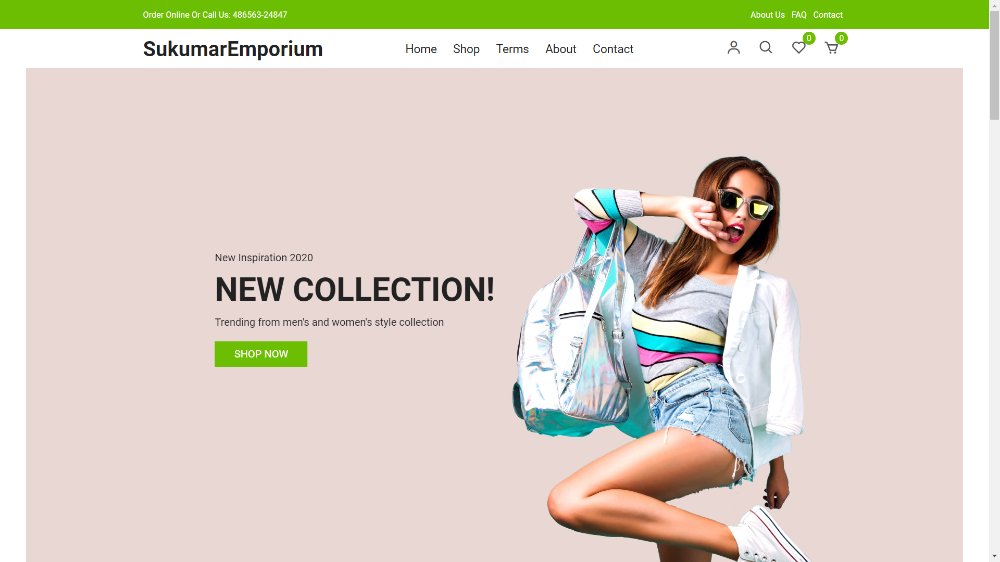
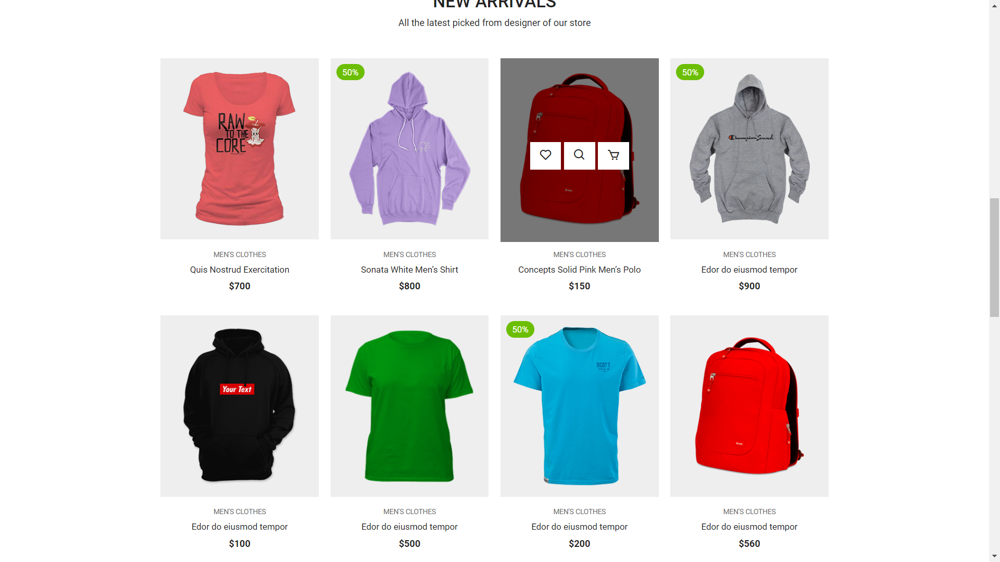

# Codetech-task-2
# Ecommerce Website

This repository showcases my skills and projects in both frontend and backend development. As a third-year B.Tech student in Artificial Intelligence and Data Science at KCG College of Technology, I am passionate about building robust and user-friendly applications.

**Name:** Bodapatla Sukumar 
**Company:** Codtech IT Solutions  
**ID:** CT08DS7726  
**Domain:** Full-stack Development  
**Duration:** August 30, 2024 - September 30, 2024

## Key Activity Overview

The Full-Stack Developer Portfolio showcases a collection of projects that demonstrate my expertise in both frontend and backend development. This portfolio is designed to highlight my ability to create dynamic, responsive, and user-friendly web applications, with a focus on delivering a seamless user experience and efficient performance.

## Key Activities

### Frontend Development
- **Activity:** Designing and implementing user interfaces using HTML, CSS, and JavaScript.
- **Outcome:** Creating visually appealing and intuitive interfaces that enhance user experience.
- **Tools/Technologies:** React, Vite, CSS frameworks (e.g., Bootstrap, Tailwind CSS).

### Backend Development
- **Activity:** Building and maintaining server-side application logic.
- **Outcome:** Ensuring reliable and scalable backend services that support frontend operations.
- **Tools/Technologies:** Node.js.

### Database Management
- **Activity:** Creating RESTful APIs to enable communication between the frontend and backend.
- **Outcome:** Providing a structured way for frontend applications to interact with backend services.
- **Tools/Technologies:** Express.js, Postman.

### Authentication and Authorization
- **Activity:** Implementing user authentication and authorization mechanisms.
- **Outcome:** Ensuring secure access to application features and data.
- **Tools/Technologies:** JWT (JSON Web Tokens), OAuth.

### Deployment and Hosting
- **Activity:** Using Git and GitHub for version control and collaborative development.
- **Outcome:** Managing code changes efficiently and collaborating with other developers.
- **Tools/Technologies:** Git, GitHub.

### Testing and Debugging
- **Activity:** Ensuring web applications are responsive across different devices and screen sizes.
- **Outcome:** Providing a consistent user experience on desktops, tablets, and mobile devices.
- **Tools/Technologies:** CSS Media Queries, Responsive Design Principles.

### Continuous Learning and Improvement
- **Activity:** Staying updated with the latest trends and technologies in web development.
- **Outcome:** Continuously improving skills and adopting best practices in development.
- **Tools/Technologies:** Online courses, webinars, tech blogs.

These key activities encompass the full scope of work involved in developing and maintaining a full-stack portfolio, demonstrating a comprehensive skill set in modern web development.

